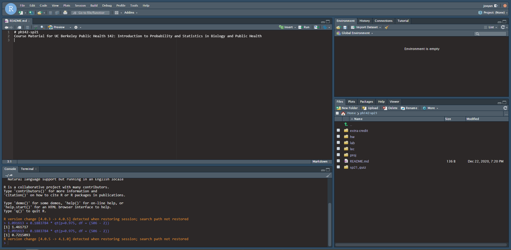
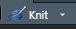
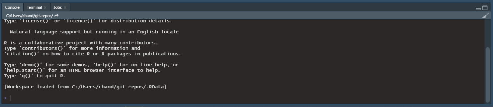

```{r, warning=F, message=F, echo=F}
library(dplyr)
library(ggplot2)
```

* Due date: July 7th, 10:00pm (make sure to provide enough time for Gradescope
submission to be uploaded if you include large image files).

* This assignment set will be graded for completion as part of your lecture participation grade

* The goal of this assignment is for you to become familiar with the systems we will be using for this course and to practice submitting assignments using these systems.


--------------------------------------------------------------------------------

**Part 1 Piazza [1 point].** 

Navigate to the course Piazza site.  There is a link to our course Piazza site on the course website.

If you have not used Piazza before, take some time to get oriented. 
The left hand side of the screen will organize postings by when they were added, as well as keeping some "pinned" discussions at the top of the list.
We will keep the current week's announcements "pinned" so that you can easily locate the key announcements for the week.  
We will also use Piazza for a weekly "blast" of information updating you with relevant information for the current week of class.

Notice the topics along the top of the window - these indicate groupings so that you can navigate to particular topics more easily.

When you post, please be respectful.  To encourage everyone to participate we are allowing your posts to be anonymous to your classmates, however the instructor will be able to see who has posted and we will be monitoring the site. We reserve the right to remove posts that we feel are not in keeping with our Berkeley values of respectful scholarly discourse.  

Navigate to the "participation" folder.  We have posted a one question poll there.  Complete the poll.  Your answers to this are completely anonymous; neither the instructors, nor your classmates will see how you have answered.  The objective of this exercise is to make sure you are familiar with the polling function in Piazza.   


--------------------------------------------------------------------------------

**Part II gradescope online quiz [1 point].** 
This course uses gradescope to submit and grade assignments.  You must create a gradescope account in order to submit your work.
We will also be using the online testing/quiz function in gradescope.  

You should have been added to our course gradescope site.  Make sure you have one (and only one) account set up on gradescope that includes your student ID number and email address.  If you have not been added to our gradescope site, or are having difficulty accessing it, please reach out on piazza.

Once you enter the site, you should see a list of assignments that are active.  
Navigate to the "Lecture participation 1A" assignment and complete the assignment.  
This assignment is a gradescope administered quiz.  As with the the Piazza poll the objective of this exercise is just to familiarize you with the system.  


--------------------------------------------------------------------------------

**Part III Datahub/R knit and submit [1 point].** 

We will be using R on Datahub for a large portion of the course materials.

We will spend more time this week introducing R.

The objective for this assignment is to make sure you can access Datahub, knit a document and submit manually to gradescope.

Follow the link on the course website to Datahub.  

You may be asked to sign in with your Berkeley credentials.  

Once you enter the site, you should see something like this:


```{r, echo=F, out.width = "40%", fig.align='center'}

```

The lower right panel shows your location.  
Navigate to the folder ph142-su21

You should then see folders for Homework "HW", lab and lectures.

Open the HW folder by double clicking and you should see the HW00.rmd file.
This is the markdown file that generates the pdf document that is also posted on the website.  

For most of your assignments there will an automated link that will submit your work directly to gradescope.  
However, there may be some assignments that you will edit in Datahub and submit manually.


To submit the homework via the automated link, open the hw00.rmd file in Datahub.  Edit the header of the document so that your name, student ID and the date show in the header between the quotation marks.  


Next add an answer to the question below by replacing the text [ your answer here ] with your answer to the question:  

Question 1.  
Do you currently have a pet:

[ your answer here ]


Now you will "knit" the file to create a pdf document.

Look at the top menu bar in RStudio. You should see an icon of a little blue ball of yarn and the word knit:

```{r , echo=F, out.width = "40%", fig.align='center'}

```

Click this icon -- this should generate a pdf document on your computer.  

> Before submitting any assignment, **you MUST knit the file**. We require a pdf version of your submission for readability/formatting purposes.

At the bottom of every assignment, you will see a code chunk that contains the command to run the autosubmission script:

>> cd; cd ph142-su21/hw/hw00; python3 turn_in.py

Copy and paste this link into the terminal, which you can find on the bottom-left window (typically next to 'Console').

```{r , echo=F, out.width = "40%", fig.align='center'}

```
> If your terminal isn't there, then at the top toolbar click on "View" -> "Move Focus to Terminal"

Once you press enter, the script will ask if you have knitted your file.

If you have successfully knitted your file, it will prompt you for your email and password associated with your Gradescope account.

- You must have an actual password set up via Gradescope. If you do not have one set up: Log-in through your school credentials, click on Account -> Edit Account, and create a password and click on 'Save Changes'
- When prompting for your password, it'll seem as if nothing is being typed into your console. That's ok! Your inputs are still being recorded, but isn't shown due to privacy reasons. 

Once you input your credentials and the script says the submission was successful, please log onto Gradescope to double-check that it has been submitted successfully.


Helpful hint for the future:

- Knit your file early and often to minimize knitting errors! If you copy and paste code, you are bound to get an error that is hard to diagnose.
Hand-typing code is the way to smooth knitting! We recommend knitting your file each time after you write a few sentences/add a new code chunk, so you can detect the source of knitting errors more easily.
 
