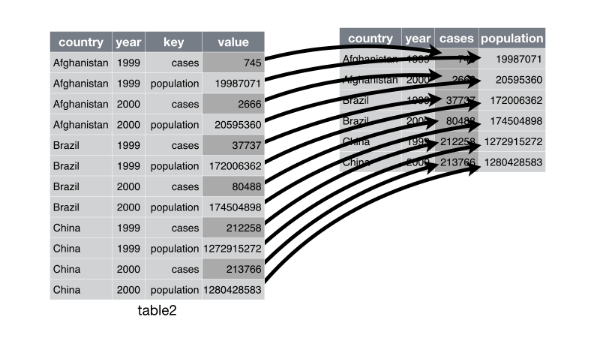

### Instructions 
* Due date: Friday, August 6 at 10:00pm PST with 2 hour grace period.
* Late penalty: 50% late penalty if submitted within 24 hours of due date, no 
marks for assignments submitted thereafter.
* This assignment is graded on **correct completion**, all or nothing. You must pass all public tests and submit the assignment for credit.
* Submission process: Follow the submission instructions on the final page. Make sure you do not remove any `\newpage` tags or rename this file, as this will break the submission.

### Introduction

Part 1 of this lab focuses on two data sets sampled from data collected early in the HIV epidemic. Part 2 focuses on conducting a t-test, and compares results from a paired test vs. independent test.

### Section I: HIV data

- We have two data sets, both sampled from data collected relatively early in the HIV epidemic. 
- Deeks, et al. (1999) performed a longitudinal study of HIV-infected adults undergoing Highly Active Anti-Retroviral Therapy (HAART) at San Francisco General Hospital (SFGH). 
- Patients were included in this analysis if they received at least 16 weeks of continuous therapy with an anti-retroviral regimen.
- For both data, the outcome is a measure of severity of the disease, a count of an immune cell type called CD4.

### More on data

- The first data set, deeks_ex1.csv, has one response measurement per subject, 
which is their average CD4 count.  
    + The data set also contains a single binary covariate `age` (=1 if $\ge40 years$, 0 if $\le 40$).
- The second data set, deeks_ex2.csv has two measurements per individual, one at
each level of the covariate binary viral load (`vl` = 1 if $\ge$ 2000,  `vl` = 0 if $\le$ 2000).

### Age versus CD4 count
1. After importing deeks_ex1.csv into R, compare visually the distribution of CD4 counts between individuals where `age`=1 vs. `age`=0. Note that these datasets are located in the data folder.

```{r ans1, message = F, warning = F}
library(ggplot2)
library(readr)
library(dplyr)
library(tidyr)
library(tidyverse)
library(testthat)
```

```{r}
deeks1 <- 'LOAD DATA HERE'
p1 <- 'YOUR GGPLOT CODE HERE'
p1

```


2. Which of the testing procedures that we've learned so far can be used to test the difference between the mean CD4 counts across individuals with `age=1` vs. `age=0`? Perform the test using an R testing function. Note the estimated mean difference and the provided 95% confidence interval. Report your p-value rounded to 2 decimal places.

(If you have extra time, confirm that you can calculate the test statistic using dplyr functions only.)

```{r ans2}
# YOUR T-TEST CODE HERE

pvalue_deeks <- 'REPLACE WITH P-VALUE ROUNDED TO 2 DECIMAL PLACES'

# YOUR CODE HERE
```

```{r}
. = ottr::check("tests/p2.R")
```
_Type your answer here, replacing this text._

### CD4 count and viral load

3.1 After reading in deeks_ex2.csv, visualize the distribution of *individual differences* in CD4 counts during periods of high vs. low viral load measurement. To do this, first note that the data is in long format (with two rows per individual, one for each level of `vl`). To calculate the difference in CD4 count for each individual across levels of `vl` we need to convert the data into "wide" format so that the CD4 measures at `vl=0` and `vl=1` are contained in the same row for each individual. To do this, you need to use the `spread()` function from `tidyr`. Your GSI will help with this if you can't figure it out! 


Here is an illustration of how spread works:
```{r}

```

```{r ans3}
# YOUR CODE HERE
```

4. Which of the testing procedures that we've learned so far can be used to test the difference between each individual's CD4 count during a time of high vs. low viral load? Perform the test using an R testing function. Note the estimated mean difference and the provided 95% confidence interval. Report your p-value rounded to 4 decimal places.

```{r ans4}
## PUT YOUR T-TEST CODE HERE

pvalue_deeks2 <- 'REPLACE WITH P-VALUE ROUNDED TO 4 DECIMAL PLACES'

```

```{r}
. = ottr::check("tests/p4.R")
```
_Type your answer here, replacing this text._


\newpage

### Section II: Coin Flip Game.

*If you are doing this lab before your lab section, please answer the questions using the sample Googlesheet*


Go to this [website](https://faculty.washington.edu/chudler/java/rldot.html)

The game: See how many dots you can hit in the grid within 30 seconds. We will each try this once with our dominant hand and once with our non-dominant hand (**where your dominant hand is the one you prefer to operate a computer mouse or track pad with**).

Instructions:

Flip a coin to see which hand to play the game with first:
    - Heads = dominant hand first
    - Tails = non-dominant hand first

**5. Re-do the game, this time with the other hand. Record the results in the spreadsheet.**

**6. Read the data from the google sheet into R.** 

# Lab 101B: https://docs.google.com/spreadsheets/d/1IxybE5KAHHwLKNni5jFErT8e7JXp1nhYB64kHL6Sheg/edit?usp=sharing
# Lab 102B: https://docs.google.com/spreadsheets/d/1Ao2Y9sSwGlguHDct2I4z4c6q6TPETTYTsfP7Uy6o5L0/edit?usp=sharing
# Lab 103B: https://docs.google.com/spreadsheets/d/1OmUtQZ79Dx68Gfl8kJgAZrfPN6mAnveDTAIHBUY6tWw/edit?usp=sharing
# Lab 104B: https://docs.google.com/spreadsheets/d/1ZxsNxSLv514xfHyK3NYtBF5_lb0dyy8Q4vAjGnH6zZU/edit?usp=sharing
# Lab 105B: https://docs.google.com/spreadsheets/d/1qAeUPN6PsvVHPgRW-rCEWSRm1blUbzPDAqaVn0B0gNI/edit?usp=sharing
# Lab 106B: https://docs.google.com/spreadsheets/d/1rgY7CEtvRUSvVD6mVFRi0O3u4UbaOfae2mJammCfdEg/edit?usp=sharing

# sample: https://docs.google.com/spreadsheets/d/1v9Mvm2hAOB3orINrcbVldJaH1UHcsotynn91Ppyi7OY/edit?usp=sharing

Load these packages:

```{r read-into-r}
library(googlesheets)
library(dplyr)
```

Hit "enter" after your lab. For example, if I am in Lab101B, I would hit "enter" after `Lab101B:` so the variable `my_key` is on its own line and takes the value of the long string of letters and numbers.

```{r select-key}

#Lab101B: my_key <- "1IxybE5KAHHwLKNni5jFErT8e7JXp1nhYB64kHL6Sheg"
#Lab102B: my_key <- "1Ao2Y9sSwGlguHDct2I4z4c6q6TPETTYTsfP7Uy6o5L0"
#Lab103B: my_key <- "1OmUtQZ79Dx68Gfl8kJgAZrfPN6mAnveDTAIHBUY6tWw"
#Lab104B: my_key <- "1ZxsNxSLv514xfHyK3NYtBF5_lb0dyy8Q4vAjGnH6zZU"
#Lab105B: my_key <- "1qAeUPN6PsvVHPgRW-rCEWSRm1blUbzPDAqaVn0B0gNI"
#Lab106B: my_key <- "1rgY7CEtvRUSvVD6mVFRi0O3u4UbaOfae2mJammCfdEg"

#sample: my_key <- "1v9Mvm2hAOB3orINrcbVldJaH1UHcsotynn91Ppyi7OY"
```


Run these lines of code.

# STOP: Remove eval = F before continuing

```{r, eval = F}
our_sheet <- my_key %>%
  gs_key(lookup = FALSE) %>% 
  gs_read(range = "A1:D100")

# This creates a dataframe called our_sheet
``` 

7. These data are very naturally paired. What two assumptions do we need to make to use a paired t-test? For each assumption, either write why you think the assumption is met (or not met), or investigate the assumption by creating a plot, and comment on whether the plot supports the assumption.

```{r investigate-assumption}
## PUT YOUR CODE HERE: Write your code here to investigate the other assumption. 
## Hint: You need to first compute a new variable using dplyr before you make your plot :)

# hands <- 'YOUR CODE HERE'

```

_Type your answer here, replacing this text._

8. Before performing the test, take a look at the data by making a "dumbbell" plot. This type of plot has student name on the y-axis, and the number of dots hit on the x axis. For each student you put a point at the two reaction times and connect them with a line. Here is the code to make the plot. We can also color the points by hand dominance. Based on the plot, comment on whether there appears to be a significant difference between the number of points hit between the dominant and non-dominant hand.

Here is the code to make the dumbbell chart. You will need to change `data` to the name of your saved dataset.

# STOP: Remove eval = F before continuing

```{r make-dumbell-chart, eval = F}
# This code is provided to students because it is a bit advanced.
# You are not expected to know how to make this plot yourself!
ggplot(data = hands, aes(x = Dominant_num_dots_hit, y = Student_name)) +
  geom_segment(aes(xend = Non_dominant_num_dots_hit, yend = Student_name)) + 
  geom_point(aes(col = "Dominant")) +
  geom_point(aes(x = Non_dominant_num_dots_hit, col = "Non-dominant"))
```

_Type your answer here, replacing this text._


9. Use R to conduct a paired two-sided t-test on the data, and note the 95% confidence interval for the test. Report your p-value rounded to 2 decimal places. Interpret the p-value and the confidence interval for the test. 

```{r conduct-paired-t-test}
## PUT YOUR T-TEST CODE HERE

pvalue_paired <- 'REPLACE WITH YOUR PVALUE ROUNDED TO 2 DECIMAL PLACES'

```

```{r}
. = ottr::check("tests/p9.R")
```
_Type your answer here, replacing this text._

10. Re-run the code for the test, but this time set `paired=F`, which is incorrect. The reason we want to run the incorrect test is to compare the p-value from this test to the p-value from the paired t-test. Is it smaller or larger? Why is that?

```{r}

# YOUR T-TEST CODE HERE

# Then, uncomment one of these choices:
# p10 <- 'smaller'
# p10 <- 'larger'

```

```{r}
. = ottr::check("tests/p10.R")
```
_Type your answer here, replacing this text._

11. Lastly, we didn't use the data on the last column in the data frame, which recorded whether you were randomized to using your dominant hand first. Why might this matter? What could we have done to investigate whether it mattered?

_Type your answer here, replacing this text._

\newpage

### Submission

For assignments in this class, you'll be submitting using the **Terminal** tab in the pane below. In order for the submission to work properly, make sure that:

1. Any image files you add that are needed to knit the file are in the `src` folder and file paths are specified accordingly. 
2. You **have not changed the file name** of the assignment.
3. The file is saved (the file name in the tab should be **black**, not red with an asterisk).
4. The file knits properly.

Once you have checked these items, you can proceed to submit your assignment.

1. Click on the **Terminal** tab in the pane below.
2. Copy-paste the following line of code into the terminal and press enter.

cd; cd ph142-su21/lab/lab08; python3 turn_in.py

3. Follow the prompts to enter your Gradescope username and password. When entering your password, you won't see anything come up on the screen--don't worry! This is just for security purposes--just keep typing and hit enter.
4. If the submission is successful, you should see "Submission successful!" appear as output.
5. If the submission fails, try to diagnose the issue using the error messages--if you have problems, post on Piazza. 

The late policy will be strictly enforced, **no matter the reason**, including submission issues, so be sure to submit early enough to have time to diagnose issues if problems arise.


